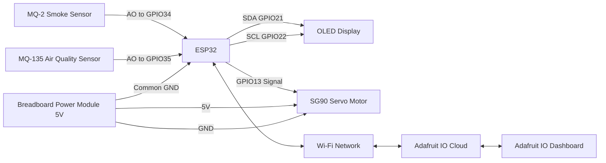

# Smart Smoke Detection and Automatic Air Freshener System

An end-to-end IoT project built with ESP32 that monitors indoor air quality using MQ-2 and MQ-135 gas sensors, displays live values on an OLED screen, and automatically activates a servo-driven air freshener mechanism when smoke or poor air quality is detected. The system also connects to Adafruit IO for cloud monitoring, remote control, and live threshold updates.

## Project Overview

This system is designed to improve indoor safety and comfort by continuously measuring smoke and air quality levels. The MQ-2 sensor is used for smoke and gas detection, while the MQ-135 sensor monitors general air quality. Sensor readings are shown in real time on a 0.96 inch OLED display.

When the measured values exceed predefined thresholds, the device changes its state from `SAFE` to `SMOKE`. In `AUTO` mode, an SG90 servo motor is triggered to simulate pressing an automatic air freshener spray. At the same time, all important data is published to Adafruit IO, where the user can monitor the system and control key functions remotely.

## Features

- Real-time smoke and air quality monitoring with MQ-2 and MQ-135
- Live OLED display for sensor values, thresholds, mode, and status
- Automatic servo activation when smoke is detected
- Manual spray trigger from the cloud dashboard
- Remote switching between `AUTO` and `MANUAL` mode
- Remote threshold updates through Adafruit IO
- Wi-Fi signal strength reporting to the dashboard
- Cooldown protection to prevent repeated unnecessary servo movement

## Components List

| Component | Quantity | Purpose |
|---|---:|---|
| ESP32 DevKit | 1 | Main microcontroller and Wi-Fi connection |
| MQ-2 Gas/Smoke Sensor | 1 | Detects smoke and gas levels |
| MQ-135 Air Quality Sensor | 1 | Monitors general air quality |
| 0.96 inch OLED Display | 1 | Shows live sensor values and system status |
| SG90 Servo Motor | 1 | Acts as the automatic air freshener actuator |
| Breadboard Power Module | 1 | Provides stable 5V power for the servo motor |
| Breadboard | 1 | Circuit connection platform |
| Jumper Wires | Several | Connections between components |

## Wiring Table

| Component | Component Pin | ESP32 / Power Connection |
|---|---|---|
| OLED Display | VCC | ESP32 3V3 |
| OLED Display | GND | ESP32 GND |
| OLED Display | SDA | GPIO21 |
| OLED Display | SCL | GPIO22 |
| MQ-2 Sensor | VCC | ESP32 3V3 |
| MQ-2 Sensor | GND | ESP32 GND |
| MQ-2 Sensor | AO | GPIO34 |
| MQ-135 Sensor | VCC | ESP32 3V3 |
| MQ-135 Sensor | GND | ESP32 GND |
| MQ-135 Sensor | AO | GPIO35 |
| SG90 Servo Motor | Signal | GPIO13 |
| SG90 Servo Motor | VCC | Breadboard Power Module 5V |
| SG90 Servo Motor | GND | Breadboard Power Module GND |
| ESP32 | GND | Breadboard Power Module GND |

Important: The ESP32 ground and breadboard power module ground must be connected together. The servo motor is powered from the external 5V breadboard power module, while its signal pin is controlled by ESP32 `GPIO13`.

## System Architecture



## Cloud Setup

The project uses Adafruit IO for cloud-based monitoring and control.

### Adafruit IO Feeds

| Feed Name | Direction | Purpose |
|---|---|---|
| `mq2-value` | ESP32 to Cloud | Sends MQ-2 smoke sensor value |
| `mq135-value` | ESP32 to Cloud | Sends MQ-135 air quality sensor value |
| `smoke-status` | ESP32 to Cloud | Sends `SAFE` or `SMOKE` system status |
| `auto-mode` | Cloud to ESP32 | Enables or disables automatic mode |
| `spray-control` | Cloud to ESP32 | Manually triggers the servo motor |
| `mq2-threshold` | Cloud to ESP32 | Updates MQ-2 smoke threshold |
| `mq135-threshold` | Cloud to ESP32 | Updates MQ-135 air quality threshold |
| `wifi-rssi` | ESP32 to Cloud | Sends Wi-Fi signal strength |

### Dashboard Widgets

| Dashboard Widget | Connected Feed |
|---|---|
| Gauge | `mq2-value` |
| Gauge | `mq135-value` |
| Text / Indicator | `smoke-status` |
| Toggle | `auto-mode` |
| Button / Toggle | `spray-control` |
| Slider / Text Input | `mq2-threshold` |
| Slider / Text Input | `mq135-threshold` |
| Text / Gauge | `wifi-rssi` |

### Recommended Initial Feed Values

| Feed | Initial Value |
|---|---:|
| `auto-mode` | 1 |
| `spray-control` | 0 |
| `mq2-threshold` | 2300 |
| `mq135-threshold` | 450 |

## How It Works

The ESP32 continuously reads analog values from both sensors:

- MQ-2 on `GPIO34`
- MQ-135 on `GPIO35`

The OLED screen shows live sensor values, threshold values, current mode, and the overall system state.

### Threshold Logic

| Sensor | Threshold |
|---|---:|
| MQ-2 | 2300 |
| MQ-135 | 450 |

- If `MQ-2 <= 2300` and `MQ-135 <= 450`, the status is `SAFE`.
- If `MQ-2 > 2300` or `MQ-135 > 450`, the status becomes `SMOKE`.

When the system is in `AUTO` mode and smoke is detected, the SG90 servo motor rotates to simulate pressing an air freshener spray and then returns to its resting position. A cooldown time is used to avoid repeated activations in a short period.

The system also publishes live sensor data and device status to Adafruit IO, allowing users to monitor values, change thresholds, enable or disable automatic mode, and manually trigger the spray from the dashboard.

## OLED Screen Content

The OLED display shows the following information:

```text
Smoke Detection
MQ2: value / threshold
MQ135: value / threshold
Mode: AUTO or MANUAL
Status: SAFE or SMOKE
```

Example safe condition:

```text
Smoke Detection
MQ2: 1800/2300
MQ135: 320/450
Mode: AUTO
Status: SAFE
```

Example smoke condition:

```text
Smoke Detection
MQ2: 2600/2300
MQ135: 520/450
Mode: AUTO
Status: SMOKE
```

## Hardware Preview

### Circuit Photo


## Setup and Upload

### Required Arduino Libraries

Install the following libraries from the Arduino IDE Library Manager:

- Adafruit IO Arduino
- Adafruit MQTT Library
- Adafruit SSD1306
- Adafruit GFX Library
- ESP32Servo

### Board Settings

| Setting | Value |
|---|---|
| Board | DOIT ESP32 DEVKIT V1 or ESP32 Dev Module |
| Port | Selected ESP32 COM port |
| Upload Speed | 115200 |
| Serial Monitor Baud Rate | 115200 |

### Wi-Fi and Adafruit IO Configuration

The ESP32 code must include the following private configuration values:

| Field | Description |
|---|---|
| Wi-Fi SSID | Local Wi-Fi network name |
| Wi-Fi Password | Local Wi-Fi password |
| Adafruit IO Username | Adafruit IO account username |
| Adafruit IO Key | Adafruit IO account key |

For security, do not publish the real Adafruit IO key in public repositories. Replace it with a placeholder such as `YOUR_ADAFRUIT_IO_KEY` before sharing the code.

### Upload Steps

1. Connect the ESP32 to the computer using a USB data cable.
2. Select the correct ESP32 board and COM port in Arduino IDE.
3. Disconnect the servo signal wire during upload if upload errors occur.
4. Upload the code to the ESP32.
5. Reconnect the servo signal wire to `GPIO13` after upload.
6. Open Serial Monitor at `115200` baud.
7. Verify that the ESP32 connects to Wi-Fi and Adafruit IO successfully.
8. Open the Adafruit IO dashboard and observe the live sensor data.

## Use Cases

- Indoor cigarette smoke detection
- Small room air quality monitoring
- Automatic air freshener triggering
- Remote environmental monitoring through the cloud
- Educational IoT and embedded systems demonstrations

## Notes

- MQ-series sensors may require calibration for stable readings.
- Servo motors should be powered from an external 5V source, not directly from the ESP32.
- Shared ground between the ESP32 and external power supply is required for proper servo control.
- Threshold values may need adjustment depending on the environment and sensor behavior.
